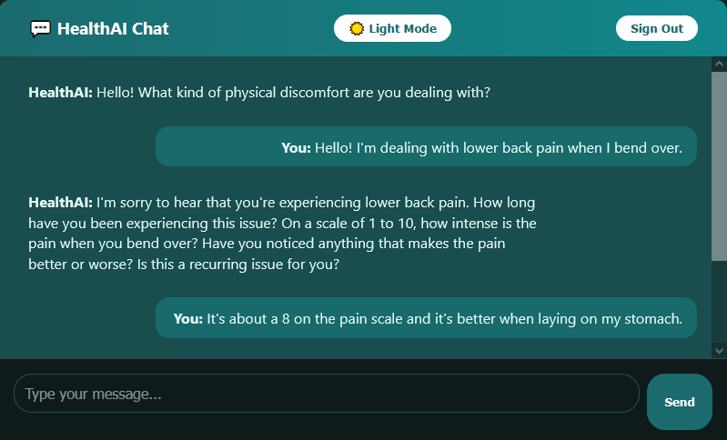
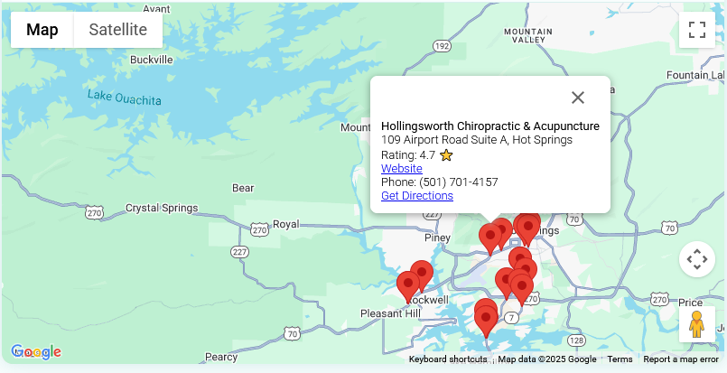

# 🩺 HealthAI

**HealthAI** is a full-stack web application that offers AI-powered mental and physical health support. Users can chat with a conversational assistant that responds empathetically and intelligently, then recommends relevant local specialists using Google Maps.

This project was built as a personal learning experience, with the goals of mastering React, Flask, Firebase Authentication, and integrating external APIs in a real-world environment.

---

## 🌐 Live Demo

Coming soon (free hosting via Firebase or Render)

---

## 📸 Screenshots




---

## ⚙️ Tech Stack

| Area          | Tools Used                              |
|---------------|------------------------------------------|
| Frontend      | React, CSS Modules, Google Maps JS API  |
| Backend       | Python, Flask, OpenAI API                |
| Auth          | Firebase Authentication (Google Sign-In) |
| Hosting       | (TBD: Firebase Hosting or Render)        |
| Deployment    | GitHub                                   |

---

## ✨ Features

- ✅ Secure Google Sign-In via Firebase
- ✅ Persists user preferences (age, health focus) across reloads
- ✅ Dark Mode toggle with localStorage memory
- ✅ ChatGPT-style conversation with health-specific AI prompts
- ✅ Intelligent provider recommendations using symptom extraction + Google Maps Places API
- ✅ Beautifully styled responsive UI

---

## 🔐 Environment Variables

You will need to set the following in your `.env` files:

### Frontend (`frontend/.env`)
```env
REACT_APP_GOOGLE_MAPS_API_KEY=your_google_maps_api_key

## 🦠 Current Bugs
- Light mode will make it so you can't see pin info on the map (fix coming soon)


